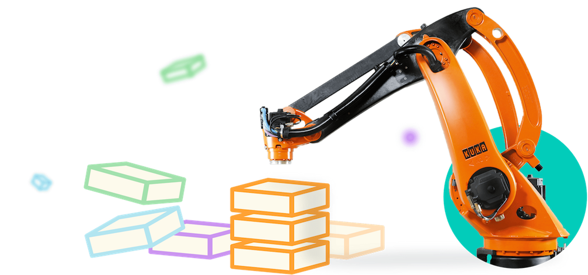

# Udacity-Robotics
These are work and projects I developed as a part of [Udacity Robotics Nanodegree Program](https://www.udacity.com/robotics).

## Environment Setup
Make sure you have Anaconda installed. Then, run `conda env create -f environment.yml` to install all necessary pacakges needed for all my projects.

If you have issues installing packages, get more instructions [here](https://github.com/ryan-keenan/RoboND-Python-Starterkit).

