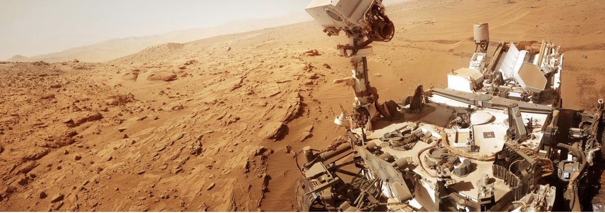

[](https://www.udacity.com/robotics)



# Search and Sample Return

[//]: # (Image References)

[image1]: calibration_images/example_grid1.jpg
[image2]: calibration_images/example_rock1.jpg 
[image3]: misc/rover_image.jpg
[image4]: misc/grid_perspective_transform.png
[image5]: misc/autonomous_mode.jpg
[image6]: misc/grid_threshold.png
[image7]: misc/grid_with_direction.jpg
[image8]: misc/rock_threshold.png
[image9]: misc/vision.png
[image10]: misc/simulator_setting.png
[image11]: misc/simulator.png

## Project Objective
In this project, I will be writing code to autonomously map a simulated environment, search for samples of interest, and pick them up. 

This project is inspired by the [NASA sample return challenge](https://www.nasa.gov/directorates/spacetech/centennial_challenges/sample_return_robot/index.html)

## Get the Code 
You can download this folder of code [here](https://tugan0329.bitbucket.io/downloads/udacity/robotics/search-and-sample-return/p1-search-and-sample-return.zip)

## Watch the Autonomous Mode Video
You can watch a demo run of Rover navigating the simulated environment and searching for rocks autonomously [here](https://youtu.be/IRTw2f-onKQ).

![rover][image3]

## Getting the Simulator

Use the links below to get the simulator version that's appropriate for your operating system.

[macOS Simulator Build](https://s3-us-west-1.amazonaws.com/udacity-robotics/Rover+Unity+Sims/Mac_Roversim.zip)

[Linux Simulator Build](https://s3-us-west-1.amazonaws.com/udacity-robotics/Rover+Unity+Sims/Linux_Roversim.zip)

[Windows Simulator Build](https://s3-us-west-1.amazonaws.com/udacity-robotics/Rover+Unity+Sims/Windows_Roversim.zip)

When you launch (double click on) the simulator you will have the option to set the resolution and graphics quality (choose lower resolution / quality for faster rendering). Be sure to check the box next to "Windowed" so the simulator doesn't take up the full screen. Click on the "input" tab to change the keyboard input definitions (this may be necessary if you are on a non-U.S. keyboard). The next time you launch these settings will be restored. 

Click "Play" to launch the simulator!

![simulator][image10]

Once you click Play you'll see a screen that looks like the one below. Choose "Training Mode" to be able to manually drive the rover around in the environment. You'll notice the app takes over your mouse immediately. You can use the esc key to get your mouse back.

![simulator][image11]

**Manual Controls**

Experiment in Training Mode with the various manual functions.

- Throttle, brake and steering: wsad letters or arrow keys (can also steer with mouse)
- Toggle mouse function between camera perspective and steering: esc key
-Change the viewing perspective: Tab key or mouse
- Change zoom on the viewing camera: mouse scroll
- Reset viewing camera zoom: middle mouse button (MMB)
- Activate the robot arm to pick up a sample: left mouse button (LMB) or enter key (only works when is near objective = yes)

Have a look around and explore the environment!


## Running the Autonomous Mode

Make sure you have the environment setup. If you haven't, click [here](https://github.com/ryan-keenan/RoboND-Python-Starterkit).


Navigate to the `code` folder, activate your environment, and run:

```
python drive_rover.py
```

Then, double click to open the simulator you downloaded above. 

To produce the results I have, it is recommended to use 800x600 resolution and "Fantastic" graphic quality.


## Detailed Project Analysis

### Notebook Analysis

#### 1. Image Analysis

The `perspect_transform` function turns a Rover perspective image to a top-down view.

```
def perspect_transform(img, src, dst):  
    M = cv2.getPerspectiveTransform(src, dst)
    warped = cv2.warpPerspective(img, M, (img.shape[1], img.shape[0]))
    
    return warped
```

For example,

![Before perspective transform][image1]

![After perspective transform][image4]

The `color_thresh` function will return a binary image where it is 1 when that pixel color value in the `img` is above the given RGB threshold, if `above` parameter is set to `True`. 

```
def color_thresh(img, rgb_thresh=(160, 160, 160), above=True):
    if above:
        above_thresh = (img[:,:,0] >= rgb_thresh[0]) \
                    & (img[:,:,1] >= rgb_thresh[1]) \
                    & (img[:,:,2] >= rgb_thresh[2])
        color_select[above_thresh] = 1
        return color_select
    else:
        below_thresh = (img[:,:,0] <= rgb_thresh[0]) \
                    & (img[:,:,1] <= rgb_thresh[1]) \
                    & (img[:,:,2] <= rgb_thresh[2])
        color_select[below_thresh] = 1
        return color_select
```

The default RBG value `R=G=B=160` is found to perform well in terms of determing navigable terrain. 

For example, 

![Before color threshold][image4]

![After color threshold][image6]

To find obstacle terrain, which is just the non-navigable terrain, we just set `above=False`. 

```
def obstacle_thresh(img):
    return color_thresh(img, above=False)
```

To identify the sample rocks, the low RGB threshold of `R=100, G=90, B=0` and high RGB threshold of `R=245, G=245, B=60` are found to be effective.

```
def rock_thresh(img):
    lower_bound = [100, 90, 0]
    upper_bound = [245, 245, 60]
    
    pic1 = color_thresh(img, rgb_thresh=lower_bound, above=True)
    pic2 = color_thresh(img, rgb_thresh=upper_bound, above=False)
    
    return (pic1.reshape([1, -1]) & pic2.reshape([1, -1])).reshape(img[:,:,0].shape)
```

For example,

![Rock Image][image2]

![Rock Threshold][image8]

#### 2. Mapping 
The `process_image(img)` function takes advantage of all the image analysis functions described above and performs the mapping. It maps identified pixels navigable terrain, obstacles and rock samples into a worldmap. 

To achieve this, there are 7 main steps.

First, I define the source and destination points for perspective transform. These parameters are found to be effective:

```
dst_size = 5 
bottom_offset = 6
source = np.float32([[14, 140], [301 ,140],[200, 96], [118, 96]])
destination = np.float32([[img.shape[1]/2 - dst_size, img.shape[0] - bottom_offset], \
                          [img.shape[1]/2 + dst_size, img.shape[0] - bottom_offset], \
                          [img.shape[1]/2 + dst_size, img.shape[0] - 2*dst_size - bottom_offset], \
                          [img.shape[1]/2 - dst_size, img.shape[0] - 2*dst_size - bottom_offset]])
```

Then, I apply perspective transform on the vision image recieved from Rover. This will gives us a top-down view of the environment, which is useful when constructing the map.

```
warped = perspect_transform(img, source, destination)
```

After that, I will apply the color threshold to identify navigable terrain/obstacles/rock samples.

```
navigable_threshed = color_thresh(warped)
obstacle_threshed = obstacle_thresh(warped)
rock_threshed = rock_thresh(warped)
```

To update the worldmap, we need to first transform our post-analysis image to be rover-centric so the position of rover is at position `(0,0)` instead of the bottom middle of the image. Then, we need to scale the image smaller the fit in our worldmap. 

These are accomplished by mainly two supporting functions: `rover_coords` which converts from image coordinates to rover coordinates, and `pix_to_world` which applies rotation, translation, and clipping. You can view more details on these functions by visiting the `perception.py` script.

Here is an example of the entire process:

![Full Mapping Process][image7]

### Autonomous Navigation and Mapping

#### 1. Perception Step

The perception of the Rover is handled in the `perception_step()` (at the bottom of the `perception.py` script). In this step, I will perform relevant image analysis and mapping, update the Rover vision and worldmap, and prepare data to be used for the decision step next.

This step is highly similar to the `process_image` described above in the "Notebook Analysis - Mapping" section. There are only three more modifications.

First, I only update the worldmap when Rover has a normal view. In other words, not when it is stuck in a rock, beyond the simulated world boundry, or got flipped and looking at the sky. I accomplish this by updating the world map only when Rover roll and pitch are both smaller than `0.7` or bigger than `359.5`.

```
roll, pitch = Rover.roll, Rover.pitch
if roll <= 0.7 or roll >= 359.5:
        if pitch <= 0.7 or pitch >= 359.5:
        Rover.worldmap[obstacle_y_world, obstacle_x_world, 0] += 255
        Rover.worldmap[rock_y_world, rock_x_world, 1] += 255
        Rover.worldmap[navigable_y_world, navigable_x_world, 2] += 255
```
 
Second, I update a vision map so users can see what Rover is perceiving, where red indicates obstacles; blue indicates navigable terrain, and green/yellow indicates the rock.

```
Rover.vision_image[:,:,0] = obstacle_threshed * 255
Rover.vision_image[:,:,1] = rock_threshed * 255
Rover.vision_image[:,:,2] = navigable_threshed  * 255
```

For example,

![Vision Map][image9]

Third, I also calculate the angles and distances of both navigable terrain and rock in polar coordinates via `to_polar_coords` (also defined in `perception.py` script). These data will help make the decision of where to go in the decision step.

```
 _ , Rover.rock_angles = to_polar_coords(rock_x_rover, rock_y_rover)
Rover.nav_dists, Rover.nav_angles = to_polar_coords(navigable_x_rover, navigable_y_rover)
```

#### 2. Decision Step

The decision step of the Rover is handled in the `decision_step()` (in `decision.py`). In this step, I will write conditional logic to control the behaviors of the Rover.

There is a moderate amount of code written for this step, so I will only explain the high level strategy here.

**In the 'forward' mode**

1. If there is still more navigable terrin to explore and it hasn't reached the max velocity `2.5 m/s` I defined, I let Rover keep accelerating at `0.25 m/s^2` until it has reached its max velocity. Otherwise, I stop the Rover and swtich to 'stop' mode.
2. When moving, I set the steer to the mean of navigable angles with outliers (i.e. outside 25-75% IQR) excluded, clipped to reside between (-15 and 15 -- the Rover limit). By doing this, Rover will always try to go in the direction in the middle of navigable terrain, and also smoothly without constatly turning left and right for a tiny amount.
3. When the navigable angles are big and wide enough -- the boundry is determined by a parameter called `random_direction_angles`, I set  the steer to a random angle sampled from a normal distribution (centered at the navigable angles mean, plus or minus 3 based on the direction it's going right now, with standard deviation of 3) with the probability of 40%. The **rationale** behind this complicated random sampling is to add randomness so Rover has the chance of going to different places when come to a big open space, instead of always going to the same direction and never be able to explore other places.

Here is an example of the code used for idea 3:

```
def mean_without_outlier(arr):
    low = np.percentile(arr, 25)
    high = np.percentile(arr, 75)
    total = list()
    for c in arr:
        if c >= low and c <= high:
            total.append(c)
    return np.mean(total)
    
Rover.steer = np.clip(mean_without_outlier(Rover.nav_angles * 180/np.pi), -15, 15)
if len(Rover.nav_angles) >= Rover.random_direction_angles:
    if np.random.random() <= 0.4:
        if Rover.steer >= 0:
            Rover.steer = np.clip(np.random.normal(Rover.steer - 3, 3), -15, 15)
        else:
            Rover.steer = np.clip(np.random.normal(Rover.steer + 3, 3), -15, 15)
```


**In the 'stop' mode**

1. If Rover is still moving, let it stop.
2. If Rover is stopped and doesn't have much navigable terrain ahead of it, let it turn around in place. This is accomplished by setting throttle to 0, brake to 0, but steer to -15.
3. If Rover is stopped and now it has enough navigable terrain ahead after turning, we let it move again by setting it to 'forward' mode.

**Dealing with Rocks**

1. If Rover is already near a rock, stopped, then pick it up. However, if Rover is still moving while being near a rock, stop to Rover immediately.
2. If Rover sees a rock with enough evidence, which is determined by comparing the amount of rock we see to a parameter named `rock_detected_angles`, we turn the Rover to the direction of the rock and move to it slowly at a speed always smaller than 1.

**Getting Unstuck**

Someimes a Rover can get stuck for various reasons. Whenever the Rover is at a speed slower than 0.2 larger than -0.2 (aka. going backwards) but in 'forward' mode, I start counting how long it has been slower than 0.2 speed. Every two seconds, I let Rover turn the steer more and more, switch between postive direction and negataive direction, and accelerating backwards. I stop the throttle and turn again before accelerating if Rover is trapped for more than 5 seconds.

#### 3. Autonomous Mode, Results, and Potential Improvements

The simulator I used for development is: **800x600 resolution, "Fantastic" graphic quality, and 22 frames per second.** Under these settings, I only need to swtich to manual mode to get Rover unstuck in very rare occasions, while getting 60.1% of the world mapped at 80.7% fidelity. Rover is also able to pick up 4 rocks under only 438 seconds. 

![Autonomous Result][image5]

_**Note: running the simulator with different choices of resolution and graphics quality may produce different results, particularly on different machines!**_

Some potential improvements includes but not limited to:

1. Go backwards after picking up a rock so Rover has more navigable terrain to decide where to go next.
2. Go alongside the mountain/obstacle when at big open space to ensure more thorough exploration.
3. Avoid running into rocks that are in the middle of an open space by taking into account of obstacles angles when deciding steer.
4. Speed up the Rover to allow faster exploration
5. Dynamically adjust the color threshold used to determine rocks so as to take into account the lighting effects on rocks
6. Have a record of where Rover has been to and hasn't so it can explore more thoroughly.
7. More clever ways to get unstuck in different situations.
8. etc.


