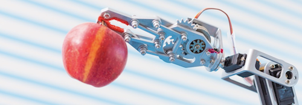

# Robotic Arm - Pick & Place

## Project Objective
In this project, I'll use Kinematics and ROS to manipulate a robotic arm in simulation with six degrees of freedom to pick up an object from one location and place it in another without running into obstacles.

## Result
This project is still under development. Stay tuned.
