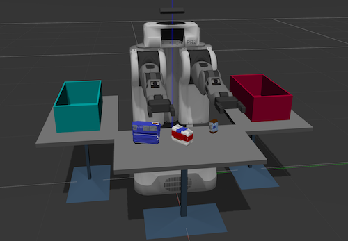

# 3D Perception

## Project Objective
In this project, I'll program a Willow Garage, two-armed PR2 robot to locate an object in a cluttered environment and then relocate it to a new location. Here I will leverage MoveIt!, one of the most powerful software packages in the ROS ecosystem to perform collision detection and motion planning.

## Result
This project is still under development. Stay tuned.
