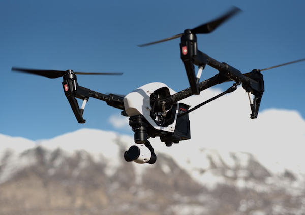
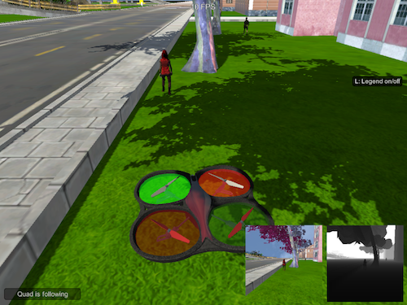

# Drone "Follow Me"

## Project Objective

In this project, I'll train a deep neural network to identify and track a target in simulation and then issue commands to a drone to follow that target. 

So-called “follow me” applications like this are key to many industries and the techniques you apply here can be extended to other powerful scenarios like adaptive cruise control in autonomous vehicles or human-robot collaboration.

## Result

You can watch a demo run of the Drone following the target in the simulated environment [here](https://youtu.be/X4Bnkwqo6D0)

#### Download Trained Weights

You can download my trained model weights [here](data/weights/final_model.h5).

## Detailed Explanation of the Project

### Network Architecture

To accomplish the task of identifying and tracking a target in simulation, we develop a deep neural network to perform image segmentation on human figures. I chose to use the state-of-art Fully Convolutional Network (FCN) architecture, which has been extensively shown by research to perform well on image segmentation tasks. I adapt skip connections from Residual Network (ResNet) architecture to this FCN architecture to help boast the performance further.

The final architecture I ended up with, after exploring parameters are as follows:

-- TO DO: put visualization with parameters here

REQUIREMENTS provide a graph, table, diagram, illustration or figure for the overall network to serve as a reference for the reviewer.

The overall architecture looks like an autoencoder architecture. It first performs convolution operations to generate feature maps, and then it upsamples using reverse convolution to generate the image segmentation maps.

REQUIREMENTS: network architecture should be explained, parameters should be explicitly stated with factual justification

REQUIREMENTS: rly explains each layer of the network architecture and the role that it plays in the overall network

Final parameters are chosen according to a hyper parameters tuning step. More details are explained in th next section.

REQUIREMENTS clear understanding of 1 by 1 convolutions and understanding of a fully connected layer and 

### Training & Hyper Parameter Tuning

REQUIREMENTS: dent explains their neural network parameters including the values selected and how these values were obtained (i.e. how was hyper tuning performed? Brute force, etc.) Hyper parameters include, but are not limited to:

Epoch
Learning Rate
Batch Size

### Network Performance

REQUIREMENTS y articulate whether this model and data would work well for following another object (dog, cat, car, etc.) instead of a human and if not, what changes would be required.

training graph

example of result performance

## Potential Improvements

. A discussion on potential improvements

